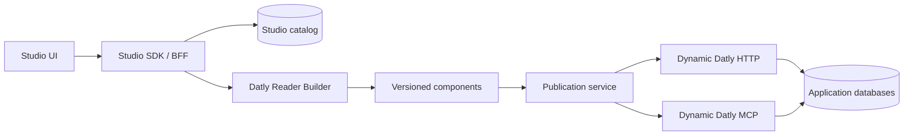

# Datly Studio

[](go.mod)
[](https://github.com/viant/datly)

**A visual authoring and operations environment for Datly 1.0 components.**

Datly Studio gives SQL-oriented teams a cohesive interface for building,
validating, publishing, and operating typed Datly readers. It uses Datly's
Reader Builder as the authoring authority instead of duplicating DQL parsing or
generation logic in the browser.

Studio starts from a component graph. Authors select a view, edit its SQL in
context, configure typed inputs and columns, inspect relations, test exact draft
versions, and publish the resulting contract through HTTP and MCP. Advanced DQL
remains available without making raw DQL the default editing experience.

> **Status:** active prerelease development against the Datly 1.0 `v1`
> codebase. APIs, storage migrations, and UI extension contracts may change
> before the first stable release.

## What Studio provides

- Graph-first authoring for root views, subviews, relations, and SQL resources.
- Structured controls for parameters, constants, predicates, fields, casts,
  tags, visibility, cache, warmup, cube, and cube-compose configuration.
- Versioned drafts with validation, exact-version tests, preview, publication,
  rollback, and runtime diagnostics.
- Governed connectors, namespaces, ACLs, and reusable Security predicates.
- Dedicated MCP tool, resource, and skill catalogs with input/output schemas.
- Canonical MCP names with reader, Cube, and Cube Compose tool variants.
- A separate dynamic Datly runtime for published HTTP and Streamable HTTP MCP
  contracts.
- An embeddable Go host boundary and frontend extension SDK for application-
  specific predicate packages and Studio workspaces.

## Architecture



| Process | Default address | Responsibility |
| --- | --- | --- |
| Vite development UI | `127.0.0.1:5173` | Frontend hot reload during development |
| Studio SDK/BFF | `127.0.0.1:8080` | Authenticated authoring and operational API |
| Static Datly control plane | `127.0.0.1:8081` | Generated Studio control components |
| Dynamic Datly HTTP | `127.0.0.1:8082` | Published component HTTP routes |
| Dynamic Datly MCP | `127.0.0.1:8091` | Published Streamable HTTP MCP server |

The Vite port is development-only. The production packaging target is a single
Studio server that embeds the built UI while retaining dedicated dynamic HTTP
and MCP listeners.

## Prerequisites

- Go `1.25.8`
- Node.js and npm compatible with Vite 6
- A sibling Datly 1.0 checkout at `../datly`
- A sibling Forge checkout at `../forge` for the UI package
- SQLite for the self-contained development catalog

The repository currently contains these local development replacements:

```text
datly_studio/  -> replace github.com/viant/datly => ../datly
ui/            -> forge: file:../../forge
```

They intentionally select the in-development Datly 1.0 and Forge sources. A
published release must replace them with released module/package versions.

## Quick start

Clone the repositories as siblings:

```sh
git clone https://github.com/viant/datly.git
git clone https://github.com/viant/datly-studio.git datly_studio
git clone https://github.com/viant/forge.git
```

Initialize the Studio catalog and preseeded SQLite reporting database:

```sh
cd datly_studio
GOWORK=off go run ./cmd/studio-migrate \
  -command init-studio \
  -dsn 'file:.data/studio.db?cache=shared'
./scripts/seed-development-sqlite.sh
```

Start the dynamic runtime with public loopback authentication for local
development:

```sh
GOWORK=off go run ./cmd/studio-runtime \
  -conf datly-runtime.development.yaml
```

Start the Studio SDK/BFF in another terminal:

```sh
GOWORK=off go run ./cmd/studio-api \
  -address 127.0.0.1:8080 \
  -dsn 'file:.data/studio.db?cache=shared' \
  -subject developer
```

Start the UI:

```sh
cd ui
npm install
npm run dev
```

Open [http://127.0.0.1:5173](http://127.0.0.1:5173).

Do not use `datly-runtime.yaml` for an unauthenticated development session: it
requires verified JWT authentication. Use `datly-runtime.development.yaml` only
on a loopback interface.

## Authoring workflow

1. Configure and test a connector.
2. Create a governed namespace and component.
3. Add inputs and trusted constants.
4. Define the view graph and edit each view's SQL in context.
5. Configure column contracts, relations, predicates, cubes, caches, and MCP
   exposure through structured controls.
6. Validate and test the exact draft version.
7. Publish it to a new runtime generation.
8. Inspect the live HTTP, MCP tool, resource, and skill contracts.

Security predicates are registered by the embedding Go application, managed in
Studio's Security catalog, and assigned to component parameters. Their alias and
column metadata is informational; the linked Go `Compute` method remains the
execution authority.

## MCP and skills

Published components may expose a base reader tool and optional variants:

```text
<mcpToolName>
<mcpToolName>Cube
<mcpToolName>CubeCompose
```

MCP tool names are canonical and system-unique. Studio discovers live contracts
through `tools/list`, including input and output schemas. Skills use the native
MCP skills capability when advertised and retain `skills/list` and `skills/get`
tool discovery for hosts without that capability.

The development MCP endpoint is:

```text
http://127.0.0.1:8091/mcp
```

## Extending Studio

Go hosts can register application-owned predicate packages without modifying
Studio internals:

```go
catalog, err := (host.Config{
    PredicatePackages: []predicatecatalog.Package{{
        Alias: "acmeiam",
        Path:  "example.com/acme/iam/authorization",
        Types: []reflect.Type{
            reflect.TypeFor[authorization.CustomerRead](),
        },
    }},
}).PredicateCatalog()
```

Frontend hosts can register additional workspaces through the UI extension SDK:

```jsx
const sdk = createStudioSDK().register(defineStudioExtension({
  id: 'acme.audit',
  label: 'Audit',
  icon: 'history',
  render: ({ api, subject, openComponent }) => (
    <AuditWorkspace api={api} subject={subject} onOpen={openComponent} />
  ),
}));

mountStudio(document.getElementById('root'), { config, sdk });
```

See [UI embedding](ui/embedding.md) for the extension contract.

## Development

Run the Go suite:

```sh
GOWORK=off go test ./...
```

Run frontend contract and rendered tests, then build the production bundle:

```sh
cd ui
npm test
npm run build
```

Run the MySQL end-to-end workflow after installing
[Endly](https://github.com/viant/endly) and configuring its documented local
credential:

```sh
cd e2e/local
endly
```

The repository keeps generated Datly components and their DQL sources together.
Changes to canonical schema or DQL contracts must regenerate the affected
components and pass the DQL inventory tests.

## Repository map

| Path | Purpose |
| --- | --- |
| `cmd/studio-api` | Studio SDK/BFF process |
| `cmd/studio-runtime` | Published dynamic HTTP and MCP host |
| `cmd/studio-migrate` | Canonical catalog migration and development seed |
| `dql/studio` | Datly control-plane DQL sources |
| `runtime` | Dynamic preview, publication, and host behavior |
| `schema` | Canonical relational schema and SQLite fixtures |
| `sdk` | Public Studio operations, DTOs, and transports |
| `studio` | Generated components and application-owned handlers |
| `ui` | React/Forge Studio frontend and extension SDK |
| `e2e` | SQLite-based system and regression fixtures |

## Security

- Production mode uses server-side sessions and verified JWT identity.
- Browser code does not store bearer tokens.
- Dynamic runtime administrative reload/status routes require a dedicated token.
- Published readers enforce owner and ACL permissions independently of catalog
  visibility.
- Development authentication and public runtime configuration are restricted to
  loopback use.

Never commit production DSNs, signing material, session keys, runtime tokens, or
database files. Deployment secrets belong in the host's secret manager or
environment-specific configuration.

## Project documentation

- [UI and interaction contract](ui.md)
- [Current architecture and engineering handoff](handoff.md)
- [Studio implementation notes](studio.md)
- [Datly 1.0 documentation](https://github.com/viant/datly/tree/v1/doc)

## License

Licensing files must be added before a public release. Until a repository-level
license is committed, the source is **not licensed for redistribution** merely
because it is visible on GitHub. Datly and each dependency retain their own
licenses.
